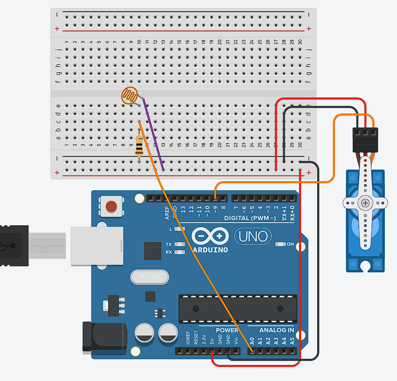
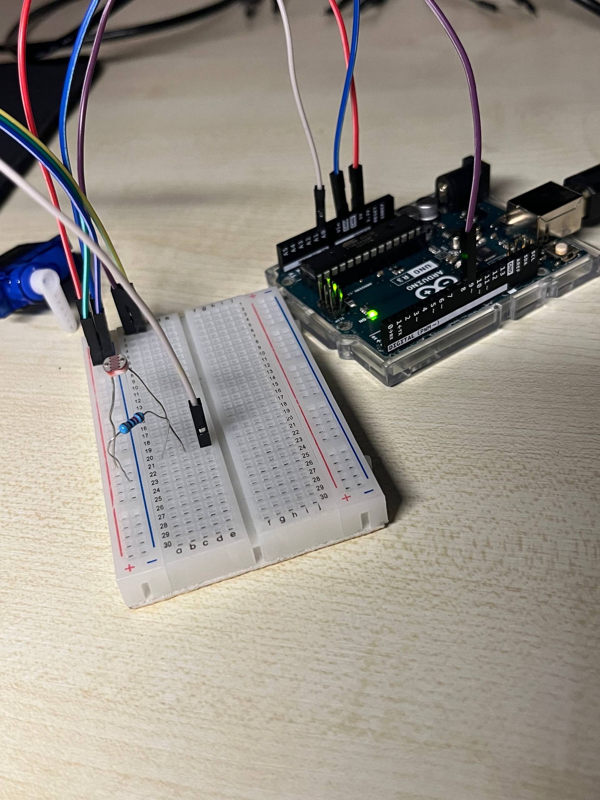

# Experiment 1 - MicroServo SG90 & Photoresistor, Normal mode

<br><br/>
## Description
My goal was to create a circuit where a photoresistor would move a MicroServo arm depending on the amount of light in the room. The main question I was trying to answer was: how can light levels as an environmental input control physical movement as feedback?

I broke this task into two parts: first, controlling the servo arm with code, and second, adding a photoresistor and making the movement depend on the light level.

I started with the "Sweep" template. By changing the `pos` variable in the `for` loops, I could adjust how the motor arm moved. I also experimented with `delay()`. When I set the delay close to zero, the arm moved very quickly and the change in `pos` was difficult to notice.

Before connecting the photoresistor, I used `rand()` to generate angles between 0 and 180. This was a way to simulate changing input values. In my first version, some movements did not have the expected delay because the two `for` loops were placed one after another. I fixed this by adding an `if` statement which checked the previous and new positions, so only the correct loop could run.

After this, I connected the photoresistor with a resistor and used Serial Monitor to collect readings. I tested it in the evening with a room lamp and a torch. The torch produced values around 850–950, the lamp was around 630, and darkness was around 0–30. From these results, I chose `700` as the threshold. In the final version, the servo moves to 90 degrees when the value is above the threshold and returns to 0 degrees when it is below it.

I also tried to make the movement smooth, but the servo made a fast movement at the start which I could not control properly. For this experiment I returned to the simpler two-position version because it worked more reliably. The servo also needed to be held in place during testing, so I used a roll of tape as a temporary stand. It was not a final construction, but it made the circuit easier to test.

<br><br/>
## Components
- Arduino UNO - Open-source microcontroller board with digital and analog inputs. It reads sensor values and controls outputs like LEDs and servos.
- Breadboard - A solderless construction base used for developing an electronic circuit and wiring with microcontroller boards. Has two power rails (+ and -) and multiple component rows.
- Jumper Cables - Wires used to connect components on the breadboard to Arduino pins or to each other.
- USB-B Power Cable - Standard USB 2.0 cable with a Type-B connector. Connects the Arduino Uno to a computer USB port.
- Photoresistor - Light-dependent resistor. Its resistance depends on the light intensity: low resistance in brightness, high - in darkness.
- 10kΩ resistor - Resistor with resistence 10,000Ω. Used together with a photoresistor, converts resistance in measurable voltage.
- Servo SG90 - Small rotary actuator that can rotate to a specific angular position (0 to 180 degrees). Controlled by PWM signals from a digital pin. Contains a DC motor, gears, and a feedback potentiometer for position control.

<br><br/>
## Content


<div align="center">

  #### Circuit diagram
  

  <br><br>

  #### Connected circuit
  

  <br><br>

  #### Sweep
  <a href="https://github.com/user-attachments/assets/3bdf08d2-1431-4daa-8c27-2c40b8408827">
    Watch the demonstration
  </a>

  <br><br>
  
  #### Sweep Random
  <a href="https://github.com/user-attachments/assets/01401968-56c8-46f7-93d3-6878c626fb1c">
    Watch the demonstration
  </a>

  <br><br>

  #### Fixed dealy bug
  <a href="https://github.com/user-attachments/assets/9c087cde-8415-4b8b-88fc-687bce521d05">
    Watch the demonstration
  </a>

  <br><br>

  #### Normal mode
  <a href="https://github.com/user-attachments/assets/82071e80-3cf3-49bb-8284-25f1c53b4da9">
    Watch the demonstration
  </a>

  
</div>


<br><br/>
## Technical information

- ```cpp
  #include <Servo.h>

  Servo myServo;

  void setup() {
    myServo.attach(9);
    myServo.write(0);
  }
  ```

  The Servo library is included and the servo signal wire is connected to pin 9. `myServo.write(0)` sets the starting angle to 0 degrees. The library allows an Arduino board to control the position of a hobby servo (Arduino, n.d.-b).

- ```cpp
  int light = analogRead(lightPin);
  Serial.println(light);
  ```

  `analogRead()` reads the photoresistor through pin A0 and stores the result in the `light` variable. On the Arduino Uno this appears as a value from 0 to 1023. The value is then printed in Serial Monitor, which helped me compare the torch, lamp and darkness readings (Arduino, n.d.-a).

- ```cpp
  int threshold = 700;

  if (light > threshold) {
    myServo.write(90);
  } else {
    myServo.write(0);
  }

  delay(100);
  ```

  This condition compares the sensor reading with the threshold of `700`. Bright light moves the servo to 90 degrees, while a lower value returns it to 0 degrees. The short delay made the readings and servo response more stable.

<br><br/>
## External sources
- Arduino (n.d.-a) *analogRead()*. Arduino Language Reference. Available at: https://docs.arduino.cc/language-reference/en/functions/analog-io/analogRead/ (Accessed: 15 June 2026).
- Arduino (n.d.-b) *Servo Library for Arduino*. GitHub. Available at: https://github.com/arduino-libraries/Servo (Accessed: 16 June 2026).
- Grammarly (n.d.) *AI at Grammarly*. Available at: https://www.grammarly.com/ai (Accessed: 2 July 2026). Used to improve writing and help with the language barrier.

<br><br/>
## Reflection
This experiment helped me understand how an analogue sensor can control a physical output. The most useful tool was Serial Monitor because without seeing the values it would have been difficult to choose a threshold. I also learned that sensor values depend on the actual room and light source, so testing and calibration are important.

Not everything worked as planned. My attempt at smooth movement caused a fast movement at the beginning, and I did not fully solve it in this version. Returning to two positions made the result simpler, but it was stable and clearly showed the connection between light and movement. I also learned that it is better to test the servo and sensor separately before combining them.

For the next experiment, I wanted to move away from only `0` or `90` degrees. The next step was to map the photoresistor readings to a wider servo range, so the torch could guide the arm more smoothly.
