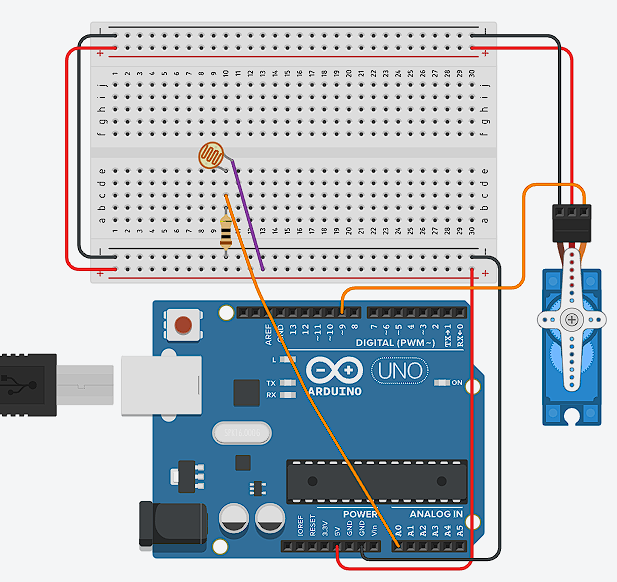

# Experiment 2 - Modified mode

<br><br>
## Description
The aim of this experiment was to improve the light interaction from Experiment 1. The first version only moved the servo between 0 and 90 degrees. It proved that the photoresistor could control movement, but the result was still quite basic. For Experiment 2, I wanted the torch to control a wider range of movement and make the servo arm feel more responsive.

I used the same circuit with an Arduino Uno, photoresistor, 10kΩ resistor and SG90 servo. The main change was in the code. Instead of checking only one light threshold and choosing a fixed position, I used `map()` to convert the photoresistor reading into an angle between 0 and 180 degrees.

Before choosing the threshold, I measured the light values in my room using Serial Monitor. The phone torch produced a value close to 1000, while normal room light was around 900. In an early test I used a threshold of `950`. After testing the movement again, I changed the final value to `920`, because this gave me a better range for testing different distances and angles of the torch in my room.

One problem was that the photoresistor reacted very quickly to small changes in light. Because of this, the servo arm moved too sharply and sometimes looked like it was shaking. I added `delay(350)` to slow down how often the program updated the position. This gave the servo more time to reach an angle before receiving another value. The response became slower, but the direction of movement was easier to see and the result felt smoother.

The physical position of the servo was also important. When it was left on the table, the body could move together with the arm. I placed it inside a small paper holder and fixed it with tape. The holder was then placed inside a roll of tape to give it more support. It was a temporary solution, but it made the demonstration more stable.

In the finished test, moving the phone torch closer to and further from the photoresistor changed the servo angle. The interaction was more direct than in Experiment 1 because the output was no longer limited to only two positions.

<br><br>
## Components
- Arduino UNO - Open-source microcontroller board with digital and analog inputs. It reads sensor values and controls outputs like LEDs and servos.
- Breadboard - A solderless construction base used for developing an electronic circuit and wiring with microcontroller boards. Has two power rails (+ and -) and multiple component rows.
- Jumper Cables - Wires used to connect components on the breadboard to Arduino pins or to each other.
- USB-B Power Cable - Standard USB 2.0 cable with a Type-B connector. Connects the Arduino Uno to a computer USB port.
- Photoresistor - Light-dependent resistor. Its resistance depends on the light intensity: low resistance in brightness, high - in darkness.
- 10kΩ resistor - Resistor with resistence 10,000Ω. Used together with a photoresistor, converts resistance in measurable voltage.
- Servo SG90 - Small rotary actuator that can rotate to a specific angular position (0 to 180 degrees). Controlled by PWM signals from a digital pin. Contains a DC motor, gears, and a feedback potentiometer for position control.

<br><br>

## Content

<div align="center">
  
  #### Circuit diagram
  

  <br><br>

  #### Measuring the light levels
  <a href="https://github.com/user-attachments/assets/114970de-abee-4e37-a3ee-e348e4d5b067">
    Watch the demonstration
  </a> 

   <br><br>
   
  #### Modified light perception mode
  <a href="https://github.com/user-attachments/assets/dd4aca5c-22ea-4741-84fd-3537a25ec423">
    Watch the demonstration
  </a>

  <br><br>
</div>

<br><br>
## Technical information
- ```cpp
  int lightPin = A0;
  int torchThreshold = 920;

  int light = analogRead(lightPin);
  Serial.println(light);
  ```

  The photoresistor value is read through analogue pin A0 and displayed in Serial Monitor. I used these readings to compare normal room light with the phone torch and set the final threshold to `920`.

- ```cpp
  if (light > torchThreshold) {
    int angle = map(light, torchThreshold, 1000, 0, 180);
    myServo.write(angle);
  }
  ```

  `map()` converts the light range from `920–1000` into a servo angle from `0–180` (Arduino, n.d.-a). The calculated angle is then sent to the SG90 using the Servo library (Arduino, n.d.-b).

- ```cpp
  else {
    myServo.write(0);
  }

  delay(350);
  ```

  If the light does not reach the torch threshold, the servo returns to 0 degrees. The delay reduces how often the position changes, which helped to reduce the sharp and unstable movement.

<br><br>
## External sources
- Arduino (n.d.-a) *map()*. Arduino Language Reference. Available at: https://docs.arduino.cc/language-reference/en/functions/math/map/ (Accessed: 17 June 2026).
- Arduino (n.d.-b) *Servo Library for Arduino*. GitHub. Available at: https://github.com/arduino-libraries/Servo (Accessed: 21 June 2026).
- Grammarly (n.d.) *AI at Grammarly*. Available at: https://www.grammarly.com/ai (Accessed: 15 July 2026). Used to improve writing and help with the language barrier.

<br><br>
## Reflection

This experiment showed me that the same hardware can create a different type of interaction just by changing the code. In Experiment 1, light worked more like a switch. In this version, the sensor value controlled a range of angles, so the movement felt more connected to what I was doing with the torch.

The most important part was calibration. A threshold that works in one room may not work in another room because the normal light level is different. Serial Monitor helped me see the difference between the room light and the phone torch instead of choosing a value randomly. I also learned that making a sensor more responsive does not always make the result better. Without the delay, the servo reacted to every small change and moved too sharply.

The `350` millisecond delay improved the demonstration, but it was still a simple solution. It also made the reaction slightly slower. With more time, I could test an average of several sensor readings instead of stopping the whole program with a long delay. This could make the movement smoother without losing as much response speed.

The next step was to combine this modified mode with the original two-position mode. I wanted the user to switch between them with a button instead of uploading a different Arduino sketch each time.
