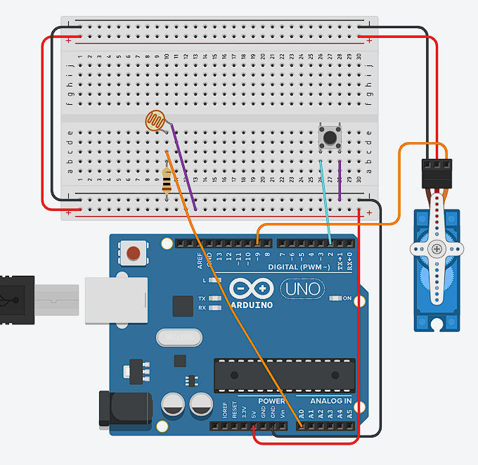

# Experiment 3 - Button switch

<br><br>
## Description
The aim of Experiment 3 was to combine the behaviours from the first two experiments. Before this, I had to upload a different program when I wanted to change how the servo reacted to light. In this version, an arcade push-button acts as a switch between the two light perception modes.

Mode 1 is the normal mode from Experiment 1. The photoresistor reading is compared with a threshold of `700`, and the servo moves either to 0 or 90 degrees. Mode 2 is based on Experiment 2. It reacts to a phone torch and maps the light value to a wider servo range between 0 and 180 degrees.

The main hardware challenge was understanding the button connections. The physical arcade button uses two wires: one connects to GND and the other connects to a digital pin. It is normally open, and pressing it closes the circuit. However, the small button used in the Tinkercad diagram has four legs. At first I was confused about which legs were connected internally. Testing the circuit showed that the legs on each side are already connected, while pressing the button joins the two sides together.

I connected the button to digital pin 2 and used `INPUT_PULLUP`. With this setup the pin reads `HIGH` while the button is not pressed and `LOW` when it is pressed. The program checks for the change from `HIGH` to `LOW` and then switches the value of `mode` between 1 and 2.

Another problem was that one physical press could be read more than once. I used `delay(200)` after changing the mode, which gave the button time to settle before another reading was accepted. The Serial Monitor was useful for checking this because it printed the current mode and light value. In the video, the monitor changes from Mode 1 to Mode 2 after the button is pressed, while the light value stays around 550.

For the modified mode I used `torchThreshold = 950`. I closed the blinds to keep the background light at a more constant and darker level. This made it easier to control the experiment because most of the changes then came from the position of the phone torch instead of changes in the room.

<br><br>
## Components

- Arduino UNO - Open-source microcontroller board with digital and analog inputs. It reads sensor values and controls outputs like LEDs and servos.
- Breadboard - A solderless construction base used for developing an electronic circuit and wiring with microcontroller boards. Has two power rails (+ and -) and multiple component rows.
- Jumper Cables - Wires used to connect components on the breadboard to Arduino pins or to each other.
- USB-B Power Cable - Standard USB 2.0 cable with a Type-B connector. Connects the Arduino Uno to a computer USB port.
- Photoresistor - Light-dependent resistor. Its resistance depends on the light intensity: low resistance in brightness, high - in darkness.
- 10kΩ resistor - Resistor with resistence 10,000Ω. Used together with a photoresistor, converts resistance in measurable voltage.
- Servo SG90 - Small rotary actuator that can rotate to a specific angular position (0 to 180 degrees). Controlled by PWM signals from a digital pin. Contains a DC motor, gears, and a feedback potentiometer for position control.
- Arcade push-button - Tactile switch button. Connects with two wires - one goes to GND, another digital pin. Normally open, when pressed, it closes the circuit, connecting two pins.

<br><br>
## Content

<div align="center">

#### Circuit diagram
  

  <br><br>

#### Button switching between two light perception modes
  <a href="https://github.com/user-attachments/assets/fb68bc7d-f68d-41f7-8cbb-bc6713b10af7">
    Watch the demonstration
  </a>

</div>

<br><br>
## Technical information
- ```cpp
  pinMode(2, INPUT_PULLUP);

  int buttonState = digitalRead(2);
  ```

  Pin 2 is configured as an input with Arduino's internal pull-up resistor. This means the unpressed button is read as `HIGH`, while pressing it connects the pin to GND and produces `LOW` (Arduino, n.d.-b).

- ```cpp
  if (lastButtonState == HIGH && buttonState == LOW) {
    mode = (mode == 1) ? 2 : 1;
    delay(200);
  }
  lastButtonState = buttonState;
  ```

  The condition detects the moment when the button changes from unpressed to pressed. The ternary operator switches between Mode 1 and Mode 2, while the 200 millisecond delay works as a simple debounce to prevent repeated mode changes from one press (Arduino, n.d.-a).

- ```cpp
  if (mode == 1) {
    if (light > threshold) {
      myServo.write(90);
    } else {
      myServo.write(0);
    }
  }
  else {
    if (light > torchThreshold) {
      int angle = map(light, torchThreshold, 1023, 0, 180);

      if (abs(angle - lastAngle) > 3) {
        myServo.write(angle);
        delay(30);
      }
    } else {
      if (lastAngle != 0) {
        myServo.write(0);
        lastAngle = 0;
        delay(330);
      }
    }
  }
  ```

  The `mode` variable decides which behaviour is active. Mode 1 selects one of two fixed angles, while Mode 2 converts the torch brightness into a wider angle range and checks the difference from the previous angle before moving.

<br><br>
## External sources
- Arduino (n.d.-a) *Debounce on a Pushbutton*. Arduino Built-in Examples. Available at: https://docs.arduino.cc/built-in-examples/digital/Debounce/ (Accessed: 23 June 2026).
- Arduino (n.d.-b) *InputPullupSerial*. Arduino Built-in Examples. Available at: https://docs.arduino.cc/built-in-examples/digital/InputPullupSerial/ (Accessed: 26 June 2026).
- Grammarly (n.d.) *AI at Grammarly*. Available at: https://www.grammarly.com/ai (Accessed: 22 July 2026). Used to improve writing and help with the language barrier.

<br><br>
## Reflection

This experiment was useful because it changed the project from separate tests into one system with different behaviours. The button gave the user direct control over the program instead of requiring a new sketch to be uploaded. It also showed me how digital input can be combined with analogue sensor readings in the same loop.

The button was more confusing than I expected. The four-legged version in Tinkercad looked like it needed four different connections, but it actually contained two internally connected sides. Understanding this made the final wiring much simpler. Using `INPUT_PULLUP` also removed the need for a separate resistor, although it reversed the button logic because a press was read as `LOW`.

The `delay(200)` solution was enough for this experiment and the Serial Monitor showed a clear change between Mode 1 and Mode 2. However, the delay temporarily pauses the rest of the program. A better future version could use `millis()` for debouncing, so the light sensor and servo could continue updating while the button is being checked.

I also learned that controlling the testing environment can be as important as changing the code. Closing the blinds gave me a more stable background light level, which made the threshold of `950` easier to test with the torch.

For the next experiment, I wanted to add visible feedback for the photoresistor values. Three LEDs could show dark, medium and bright conditions without needing to keep Serial Monitor open.
