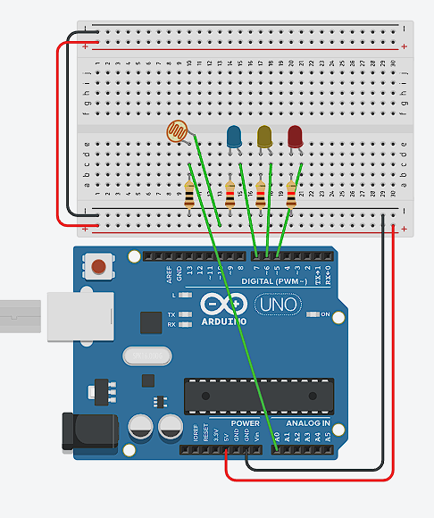

# Experiment 4 - LED indicator

<br><br>
## Description
The aim of Experiment 4 was to create visual feedback for the photoresistor readings. In the previous experiments I had to look at Serial Monitor or watch the servo movement to understand the light level. For this experiment, I used three LEDs to show dark, normal and bright conditions.

The three colours had different meanings. The red LED represented darkness, the yellow LED represented normal room lighting, and the blue LED represented bright light from a phone torch. This experiment focused only on the photoresistor and LEDs, without the servo or button from the previous experiments.

Before adding the light level logic, I tested the LEDs separately. The first video shows this simple hardware test. It helped me check that the LEDs, resistors and Arduino pins were working before I added the sensor conditions. At first the LEDs did not illuminate because I had connected the breadboard power rails incorrectly. After checking the circuit, I corrected the 5V and GND connections and the LEDs started working.

The final program reads the photoresistor through A0 and compares the result with three thresholds. Under normal room lighting, the yellow LED is active. When I covered the photoresistor with my finger, the red LED turned on to show darkness. When I brought the phone torch close to the sensor, the blue LED turned on to show a bright light level.

Another problem appeared while testing darkness. When I covered the photoresistor, the red LED was close enough for its light to reach the sensor. This changed the analogue reading and caused it to move between threshold values. I placed a small paper divider between the photoresistor and the LEDs. It was a simple physical fix, but it blocked the unwanted LED light and made the Serial Monitor values more stable.

The final demonstration showed that the circuit could communicate sensor data without a screen. The user could understand the current light condition just by looking at the LED colours.

<br><br>
## Components
- Arduino UNO - Open-source microcontroller board with digital and analog inputs. It reads sensor values and controls outputs like LEDs and servos.
- Breadboard - A breadboard is a solderless construction base used for developing an electronic circuit and wiring with microcontroller boards. Has two power rails (+ and -) and multiple component rows.
- Jumper Cables - Wires used to connect components on the breadboard to Arduino pins or to each other.
- USB-B Power Cable - Standard USB 2.0 cable with a Type-B connector. Connects the Arduino Uno to a computer USB port.
- Photoresistor - Light-dependent resistor. Its resistance depends on the light intensity: low resistance in brightness, high - in darkness.
- 10kΩ resistor - Resistor with resistence 10,000Ω. Used together with a photoresistor, converts resistance in measurable voltage.
- LED (3x) - Light Emitting Diode. A semiconductor device that emits light when current flows through it in the forward direction (anode to cathode). Requires a current-limiting 220Ω resistor to prevent damage.
- 220Ω resistor (3x) - Resistor used to limit current through an LED. Without it, the LED would draw too much current and burn out.

<br><br>
## Content

<div align="center">

#### Circuit diagram
  

  <br><br>

#### Testing the LEDs
  <a href="https://github.com/user-attachments/assets/21f0bdd0-6704-4f7e-88dd-92f27fc40fce">
    Watch the demonstration
  </a>

  <br><br>

#### LED light level indicator
  <a href="https://github.com/user-attachments/assets/4a29694e-dcc2-4d24-89ef-26ab420fdaed">
    Watch the demonstration
  </a>

</div>

<br><br>
## Technical information
- ```cpp
  int led1 = 5;
  int led2 = 6;
  int led3 = 7;

  pinMode(led1, OUTPUT);
  pinMode(led2, OUTPUT);
  pinMode(led3, OUTPUT);
  ```

  The three LEDs are connected to digital pins 5, 6 and 7. Each pin is configured as an output so the program can switch the LED between `HIGH` and `LOW` (Arduino, n.d.-a).

- ```cpp
  int light = analogRead(lightPin);
  Serial.println(light);

  digitalWrite(led1, LOW);
  digitalWrite(led2, LOW);
  digitalWrite(led3, LOW);
  ```

  The photoresistor value is read and printed in Serial Monitor. All three LEDs are then turned off before the program checks the new light level.

- ```cpp
  if (light < 470) digitalWrite(led1, HIGH);
  if (light > 500) digitalWrite(led2, HIGH);
  if (light > 650) digitalWrite(led3, HIGH);
  ```

  These conditions activate the LEDs at different sensor values. Red shows the low reading produced when the sensor is covered, yellow shows normal lighting, and blue is added when a strong torch produces a reading above `650`. Using several LEDs as an indicator for an analogue sensor is also shown in Arduino's LED Bar Graph example (Arduino, n.d.-b).

<br><br>
## External sources
- Arduino (n.d.-a) *Arduino API*. Arduino Documentation. Available at: https://docs.arduino.cc/learn/programming/reference/ (Accessed: 1 July 2026).
- Arduino (n.d.-b) *LED Bar Graph*. Arduino Built-in Examples. Available at: https://docs.arduino.cc/built-in-examples/display/BarGraph/ (Accessed: 4 July 2026).
- Grammarly (n.d.) *AI at Grammarly*. Available at: https://www.grammarly.com/ai (Accessed: 26 July 2026). Used to improve writing and help with the language barrier.

<br><br>
## Reflection

This experiment taught me that hardware should be tested in small steps. Testing the LEDs before adding the photoresistor logic made it easier to find the incorrect power rail connection. If I had built the complete system immediately, it would have been harder to understand whether the problem came from the wiring, LED pins or sensor code.

I also learned that output components can affect an input sensor. The light from the red LED changed the LDR reading, even though the LED was only meant to display the result. The paper divider was not a very technical solution, but it worked and showed that the physical placement of components matters as much as the code.

The threshold values worked for the conditions in my room, but they may need to be changed in another environment. There is also a small gap between `470` and `500` where none of the conditions are true. Because the checks are written as separate `if` statements, yellow and blue can also be active together at a high reading. In a future version I could use `if`, `else if` and `else` to create three completely separate light states.

The main result was successful because the LEDs gave immediate feedback for darkness, room light and the torch. The next step was to combine this indicator with the servo and button behaviours in the final Sunflower project.
