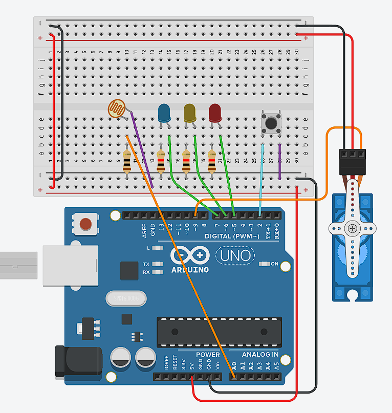
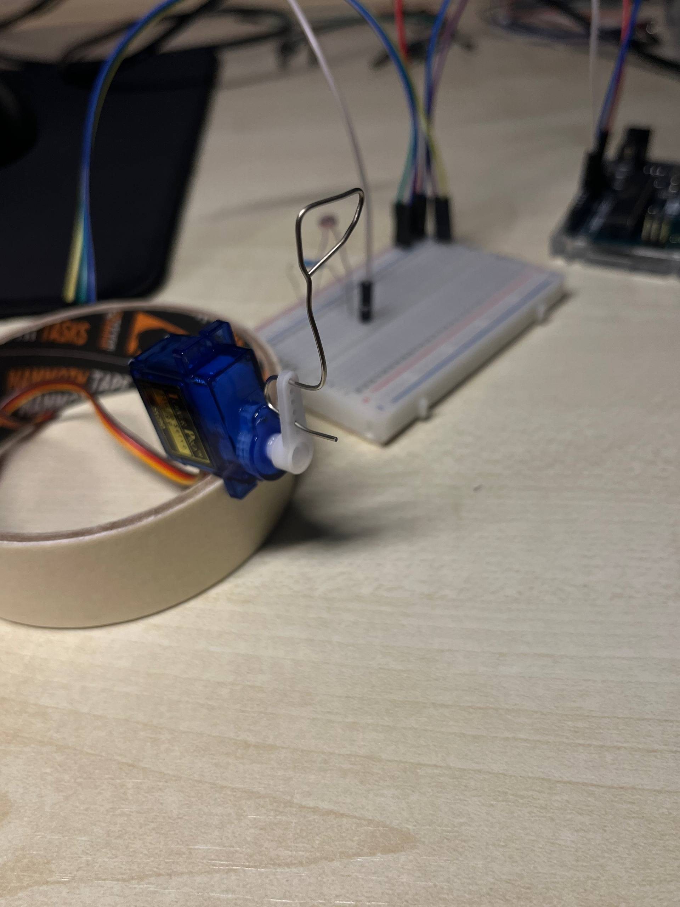

# Final Project - Sunflower

<br><br>
## Description
The idea for my final project came from sunflowers in Ukraine. When I visited villages, I often saw how sunflower heads leaned towards the sun during the day. I wanted to make a simple physical version of this behaviour using a photoresistor and a servo motor.

The final project combines the main results from all four experiments. The photoresistor reads the surrounding light, the servo moves the sunflower, the push-button changes the operating mode, and three LEDs give visual feedback about the sensor reading. The Servo library was used to control the position of the SG90 servo motor (Arduino, 2024).

The project has two modes. Mode 1 is the classic sunflower behaviour from Experiment 1. It compares the light reading with a threshold of `700`. When the reading is above the threshold, the servo moves to approximately 90 degrees. Otherwise, it returns to 0 degrees. This created a simple reaction between a dark and bright environment.

Mode 2 is the torch seeker developed in Experiment 2. In the final code, a stronger light reading above `800` is mapped to an angle between 0 and 180 degrees. This means that moving the phone torch changes the position of the servo instead of only switching between two fixed angles. The program only sends a new angle when the difference is greater than three degrees, which reduced small movements and servo jitter.

The arcade push-button from Experiment 3 switches between these two modes. It is connected to pin 2 and uses `INPUT_PULLUP`, so the button is read as `LOW` when pressed. One problem was button bouncing, because one press could sometimes switch the mode twice. I used a 200 millisecond delay as a simple debounce solution. Debouncing is used to stop one physical press being read as several presses (Arduino, n.d.-a).

The three LEDs from Experiment 4 remain active in both modes. Red represents darkness, yellow represents normal room lighting, and blue is added during bright torch light. In the final version, yellow and blue can be active at the same time under bright light because the conditions are written as separate `if` statements. This was how the completed circuit worked, so I kept this behaviour in the final project.

There were also some physical problems during assembly. The servo sometimes shook because the USB connection did not always provide stable power. At the beginning, the photoresistor readings were also unstable because I forgot the 10kΩ resistor used in the voltage divider. Another practical problem was holding the servo and wire sunflower in position. I used a roll of tape as a simple stand. It was not a finished enclosure, but it supported the construction well enough for testing.

<br><br>
## Components
- Arduino UNO - Open-source microcontroller board with digital and analog inputs. It reads sensor values and controls outputs like LEDs and servos.
- Breadboard - A breadboard is a solderless construction base used for developing an electronic circuit and wiring with microcontroller boards. Has two power rails (+ and -) and multiple component rows.
- Jumper Cables - Wires used to connect components on the breadboard to Arduino pins or to each other.
- USB-B Power Cable - Standard USB 2.0 cable with a Type-B connector. Connects the Arduino Uno to a computer USB port.
- Photoresistor - Light-dependent resistor. Its resistance depends on the light intensity: low resistance in brightness, high - in darkness.
- 10kΩ resistor - Resistor with resistence 10,000Ω. Used together with a photoresistor, converts resistance in measurable voltage.
- Servo SG90 - Small rotary actuator that can rotate to a specific angular position (0 to 180 degrees). Controlled by PWM signals from a digital pin. Contains a DC motor, gears, and a feedback potentiometer for position control.
- LED (3x) - Light Emitting Diode. A semiconductor device that emits light when current flows through it in the forward direction (anode to cathode). Requires a current-limiting 220Ω resistor to prevent damage.
- 220Ω resistor (3x) - Resistor used to limit current through an LED. Without it, the LED would draw too much current and burn out.
- Arcade push-button - Tactile switch button. Connects with two wires - one goes to GND, another digital pin. Normally open, when pressed, it closes the circuit, connecting two pins.

<br><br>
## Content

<div align="center">

#### Circuit diagram
  

  <br><br>

#### Tape used as a stand
  

</div>

<br><br>
## Technical information

- ```cpp
  myServo.attach(9);
  pinMode(2, INPUT_PULLUP);

  pinMode(led1, OUTPUT);
  pinMode(led2, OUTPUT);
  pinMode(led3, OUTPUT);
  ```

  The servo is connected to pin 9, while the button uses pin 2 with Arduino's internal pull-up resistor. Pins 5, 6 and 7 are configured as outputs for the three LEDs.

- ```cpp
  if (lastButtonState == HIGH && buttonState == LOW) {
    mode = (mode == 1) ? 2 : 1;
    delay(200);
  }
  lastButtonState = buttonState;
  ```

  This code detects the change from an unpressed button to a pressed button and switches between Mode 1 and Mode 2. The short delay prevents one press from being counted several times (Arduino, n.d.-a).

- ```cpp
  digitalWrite(led1, LOW);
  digitalWrite(led2, LOW);
  digitalWrite(led3, LOW);

  if (light < 470) digitalWrite(led1, HIGH);
  if (light > 500) digitalWrite(led2, HIGH);
  if (light > 650) digitalWrite(led3, HIGH);
  ```

  The LEDs are reset before the new sensor value is checked. Red is used for the lower range, yellow turns on above `500`, and blue is added above `650`. This type of LED indicator uses several digital outputs to display an analogue value (Arduino, n.d.-b).

- ```cpp
  if (mode == 1) {
    if (light > threshold) {
      myServo.write(90);
    } else {
      myServo.write(0);
    }
  }
  ```

  Mode 1 compares the light reading with one threshold. It sends the servo to either 90 or 0 degrees, which produces the basic sunflower movement.

- ```cpp
  if (light > torchThreshold) {
    int angle = map(light, torchThreshold, 1023, 0, 180);

    if (abs(angle - lastAngle) > 3) {
      myServo.write(angle);
      lastAngle = angle;
      delay(30);
    }
  }
  ```

  Mode 2 maps the stronger light readings to the full servo range. The `abs()` check ignores changes smaller than three degrees, so the servo does not react to every small change in the photoresistor value (Arduino, n.d.-c).

<br><br>
## External sources

- Arduino (2024) *Servo Motor Basics with Arduino*. Available at: https://docs.arduino.cc/learn/electronics/servo-motors (Accessed: 7 July 2026).
- Arduino (n.d.-a) *Debounce on a Pushbutton*. Arduino Built-in Examples. Available at: https://docs.arduino.cc/built-in-examples/digital/Debounce/ (Accessed: 10 July 2026).
- Arduino (n.d.-b) *LED Bar Graph*. Arduino Built-in Examples. Available at: https://docs.arduino.cc/built-in-examples/display/BarGraph/ (Accessed: 12 July 2026).
- Arduino (n.d.-c) *Language Reference*. Available at: https://docs.arduino.cc/language-reference/ (Accessed: 13 July 2026).
- Grammarly (n.d.) *AI at Grammarly*. Available at: https://www.grammarly.com/ai (Accessed: 29 July 2026). Used to improve writing and help with the language barrier.

<br><br>
## Reflection

The final project showed me why it was useful to divide the idea into several smaller experiments. Trying to connect the sensor, servo, button and three LEDs at the beginning would have made debugging much more difficult. By testing each part separately, I already knew that the individual behaviours worked before I combined them.

The main thing I learned was that physical computing problems do not always come from the code. Incorrect power rails stopped the LEDs from working, the missing 10kΩ resistor made the photoresistor unstable, and the LED light could affect the sensor reading. The paper shield and tape stand were very simple solutions, but they helped the real construction work more reliably.

Serial Monitor was one of the most useful tools during the project. It allowed me to see the current mode and light value instead of guessing what the Arduino was reading. This helped with selecting thresholds and checking whether the button changed the mode correctly.

The servo was probably the least stable part of the project. Small changes in light made it shake in Mode 2, so I added the three-degree difference check. USB power also limited how smoothly it could move. If I developed the project further, I would test a separate power supply for the servo and use averaging for the photoresistor readings.

I would also replace the tape stand with a stronger model of a sunflower head and stem. The final result is still simple, but it combines analogue input, digital input, LEDs, servo movement and two interaction modes in one system. Most importantly, it keeps the original idea of a Ukrainian sunflower that reacts to light while showing the development through all four experiments.
